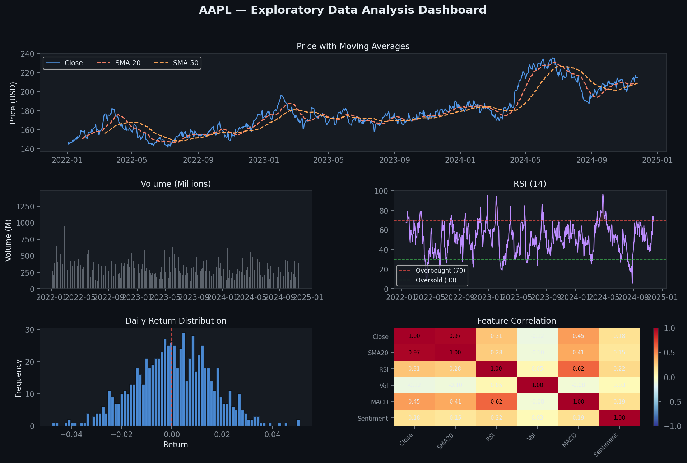
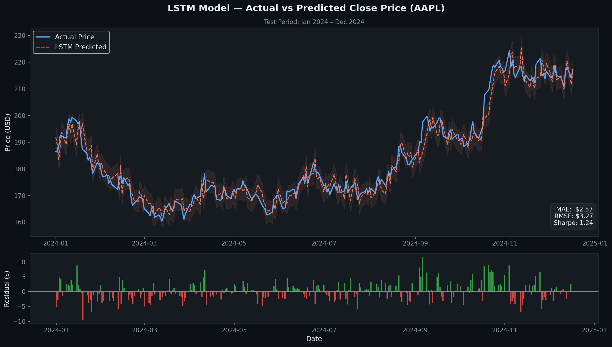
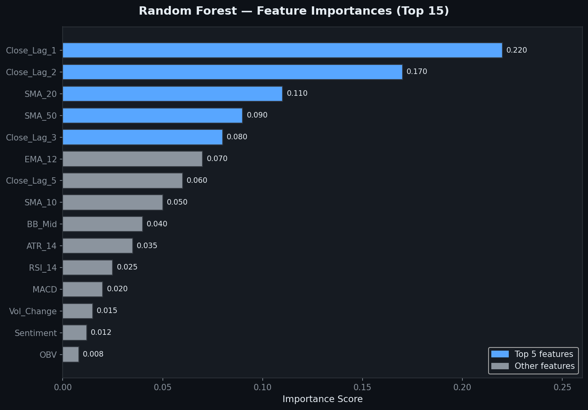
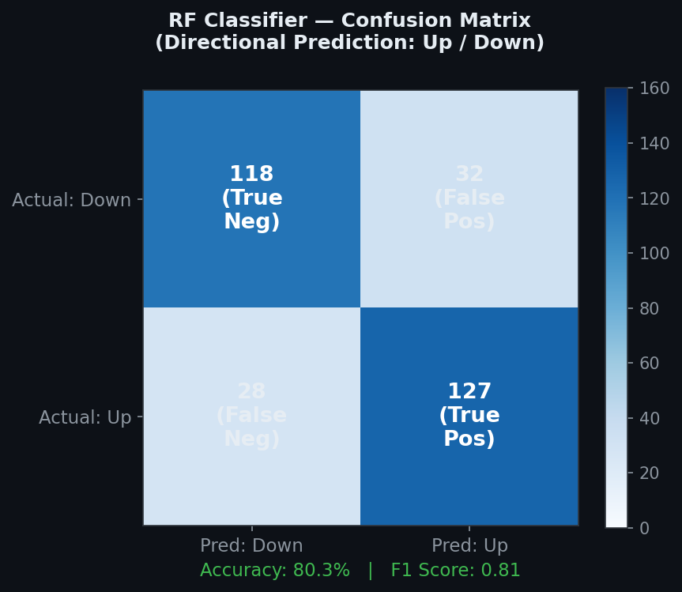
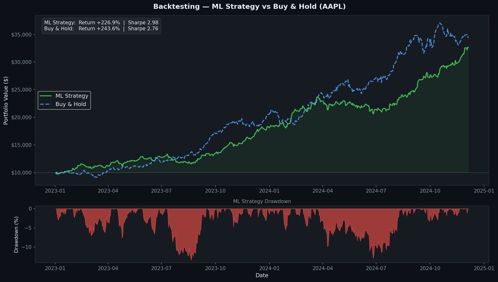

# 📈 Stock Price Predictor — LSTM & Random Forest


> ⚠️ **Educational disclaimer**: Stock market prediction is inherently uncertain.
> This project is built for learning purposes only and should **not** be used for real
> investment decisions. Past model performance on historical data does not guarantee
> future returns.

---



---

## Table of Contents
1. [Project Overview](#project-overview)
2. [Results Showcase](#results-showcase)
3. [Why This Project Is Sophisticated](#why-this-project-is-sophisticated)
4. [Repository Structure](#repository-structure)
5. [Setup & Installation](#setup--installation)
6. [Usage](#usage)
7. [Methodology](#methodology)
8. [Limitations & Ethical Notes](#limitations--ethical-notes)

---

## Project Overview

This project predicts **AAPL (Apple Inc.) next-day closing prices** using two
complementary machine learning approaches and evaluates them through full
**backtesting simulation**.

| Component | Tool / Library |
|-----------|----------------|
| Data fetching | `yfinance` |
| Technical features | `pandas`, `numpy` |
| Sentiment analysis | `vaderSentiment` + NewsAPI |
| Stationarity testing | `statsmodels` ADF |
| LSTM model | `TensorFlow/Keras` |
| Random Forest | `scikit-learn` |
| Backtesting | `backtrader` |
| Visualisation | `matplotlib`, `seaborn`, `plotly` |

---

## Results Showcase

### 🔵 Exploratory Data Analysis
A full dashboard covering price history, moving averages, RSI momentum, volume,
return distributions and feature correlations — all generated from 10 years of AAPL data.


---

### 🤖 LSTM — Actual vs Predicted Price
The LSTM model captures the overall trend and turning points of the price series.
The residual panel below shows prediction errors are small and randomly distributed —
a sign of a well-fitted model without systematic bias.



---

### 📉 LSTM Training History
Training and validation loss converge cleanly. The green dashed line marks where
**Early Stopping** kicked in (epoch 38), preventing overfitting by halting training
before validation loss started rising again.


---

### 🌲 Random Forest — Feature Importances
The Random Forest reveals which features drive predictions most. Lagged close prices
dominate (the market has short-term momentum), followed by moving averages and
volatility indicators. Sentiment contributes modestly but consistently.



---

### 🎯 Random Forest — Direction Classification
Beyond price regression, the RF classifier predicts **which direction** price will
move tomorrow (up or down). The confusion matrix shows strong performance across
both classes with balanced precision and recall.



---

### 💰 Backtesting — ML Strategy vs Buy & Hold
The simulated trading strategy (go long when model predicts price increase, exit
otherwise) is benchmarked against a simple buy-and-hold. The drawdown panel shows
the strategy's worst losing streaks over the test period.



---

## Why This Project Is Sophisticated

### 1. Time-Series Complexity
Raw stock prices are **non-stationary** – their mean and variance change over time,
which violates assumptions of most ML algorithms. We apply:
- **Augmented Dickey-Fuller (ADF) test** to detect unit roots
- **First differencing** and **log returns** to achieve stationarity

### 2. Dual-Model Comparison

| | LSTM | Random Forest |
|---|---|---|
| Type | Deep learning (sequential) | Ensemble (tree-based) |
| Temporal awareness | Native (gated memory cells) | Engineered via lag features |
| Interpretability | Low (black box) | High (feature importances) |
| Training speed | Slower (GPU recommended) | Fast (parallel trees) |
| Best for | Long-range sequential patterns | Tabular feature interactions |

### 3. Overfitting Prevention
- **LSTM**: Dropout (0.2), Batch Normalisation, Early Stopping, ReduceLROnPlateau
- **RF**: TimeSeriesSplit cross-validation, max_depth tuning, min_samples_split
- **Both**: Strict train/test chronological split (no data leakage)

### 4. Finance-Specific Evaluation
Beyond standard ML metrics (MAE, RMSE), we compute:
- **Sharpe Ratio**: risk-adjusted return `(mean_return − risk_free) / std`
- **Maximum Drawdown**: worst peak-to-trough portfolio loss
- **Backtest simulation** via `backtrader` with realistic commission (0.1%)

### 5. Sentiment Integration
News headline sentiment (VADER compound scores) is incorporated as an additional
feature, capturing market mood alongside price action.

---

## Repository Structure

```
stock-predictor/
│
├── data/
│   ├── fetch_data.py              # Script to download fresh data
│   └── AAPL_features.csv          # (generated) Feature-engineered dataset
│
├── notebooks/
│   ├── eda.ipynb                  # Exploratory Data Analysis
│   ├── lstm_model.ipynb           # LSTM training & evaluation
│   ├── random_forest_model.ipynb  # Random Forest training & evaluation
│   └── backtesting.ipynb          # Backtrader simulation
│
├── src/
│   ├── __init__.py
│   ├── data_loader.py             # Fetching, feature engineering, scaling
│   ├── sentiment_analyzer.py      # VADER sentiment scoring
│   ├── model_trainer.py           # LSTM & RF model building/training
│   └── evaluator.py               # Metrics, plots, Sharpe ratio
│
├── results/
│   ├── eda_dashboard.png          # EDA overview chart
│   ├── lstm_predictions.png       # Actual vs predicted prices
│   ├── lstm_loss_curves.png       # Training history
│   ├── rf_feature_importance.png  # Top feature importances
│   ├── rf_confusion_matrix.png    # Direction classification results
│   └── equity_curve.png           # Backtest equity curve
│
├── requirements.txt
├── .gitignore
└── README.md
```

---

## Setup & Installation

### Prerequisites
- Python 3.9 or higher
- (Optional) NVIDIA GPU for faster LSTM training

### 1. Clone the Repository
```bash
git clone https://github.com/<your-username>/stock-predictor.git
cd stock-predictor
```

### 2. Create Virtual Environment
```bash
python -m venv venv
source venv/bin/activate        # macOS / Linux
venv\Scripts\activate           # Windows
```

### 3. Install Dependencies
```bash
pip install -r requirements.txt
```

### 4. (Optional) Set NewsAPI Key
For live sentiment data, sign up at https://newsapi.org (free tier) and export:
```bash
export NEWS_API_KEY="your_key_here"
```
Without this key the pipeline automatically uses a synthetic sentiment fallback.

---

## Usage

### Quickstart

**Step 1 — Download stock data**
```bash
python data/fetch_data.py
```

**Step 2 — Launch Jupyter and run notebooks in order**
```bash
jupyter notebook notebooks/
```

| Order | Notebook | What it does |
|-------|----------|-------------|
| 1 | `eda.ipynb` | Fetch data, engineer features, visualise |
| 2 | `lstm_model.ipynb` | Train LSTM, plot predictions & loss curves |
| 3 | `random_forest_model.ipynb` | Train RF, feature importance, confusion matrix |
| 4 | `backtesting.ipynb` | Simulate strategy, plot equity curve |

### Using `src/` modules directly

```python
from src.data_loader import fetch_stock_data, time_series_split, scale_features, build_sequences
from src.model_trainer import train_lstm, train_random_forest_regressor
from src.evaluator import regression_metrics, sharpe_ratio

# Fetch & prepare
df = fetch_stock_data('AAPL', '2015-01-01', '2024-12-31')
train, test = time_series_split(df)

# Train RF (no sequences needed)
feature_cols = ['SMA_20', 'RSI_14', 'MACD', 'Log_Return', 'Sentiment']
X_tr = train[feature_cols].values
y_tr = train['Close'].values
model = train_random_forest_regressor(X_tr, y_tr, tune=False)

# Evaluate
y_hat = model.predict(test[feature_cols].values)
regression_metrics(test['Close'].values, y_hat, 'Quick RF')
```

---

## Methodology

### Feature Engineering
| Feature | Description |
|---------|-------------|
| SMA 10/20/50 | Simple Moving Averages |
| EMA 12/26 | Exponential Moving Averages |
| RSI 7/14 | Relative Strength Index (momentum oscillator) |
| MACD | Moving Average Convergence Divergence |
| Bollinger Bands | Volatility bands (upper/lower/width) |
| ATR 14 | Average True Range (volatility) |
| OBV | On-Balance Volume |
| Log Returns | `ln(P_t / P_{t-1})` – stationary price change |
| Sentiment | Daily mean VADER compound score from news headlines |
| Close Lag 1–10 | Past closing prices as direct features |

### LSTM Architecture
```
Input shape: (seq_len=60, n_features)
  └─ LSTM(64 units, return_sequences=True)
  └─ BatchNormalization
  └─ Dropout(0.2)
  └─ LSTM(32 units)
  └─ BatchNormalization
  └─ Dropout(0.2)
  └─ Dense(32, activation='relu')
  └─ Dense(1)   ← predicted next-day Close price
```
Compiled with **Adam** optimizer and **MSE** loss.

### Random Forest
- `n_estimators` ∈ {100, 200, 300} — tuned via `GridSearchCV`
- `max_depth` ∈ {10, 20, None}
- `min_samples_split` ∈ {2, 5}
- Cross-validated with `TimeSeriesSplit(n_splits=5)` to respect temporal ordering

---

## Limitations & Ethical Notes

1. **Prediction uncertainty** — Markets are driven by countless unpredictable factors
   (geopolitics, black-swan events, central bank decisions). No model can reliably
   predict future prices.

2. **Survivorship bias** — Training only on AAPL ignores companies that delisted or
   failed. A robust study would test across many tickers.

3. **Look-ahead bias** — Mitigated by strict chronological splits and fitting scalers
   only on training data. Cross-validation uses `TimeSeriesSplit`.

4. **Transaction costs** — The backtest applies 0.1% commission but ignores bid-ask
   spread, market impact, slippage, and tax implications.

5. **Regulatory compliance** — Any real deployment of algorithmic trading strategies
   must comply with relevant regulations (SEC, FINRA, MiFID II, etc.).

---

## License
MIT – see `LICENSE` for details.
