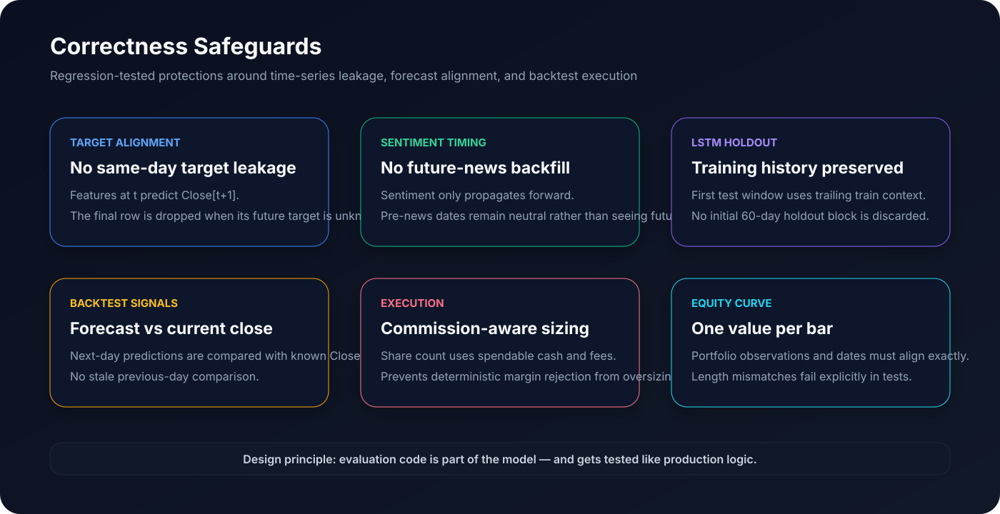
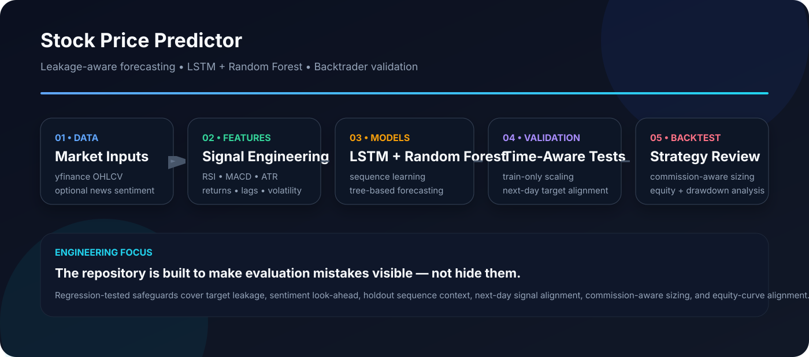
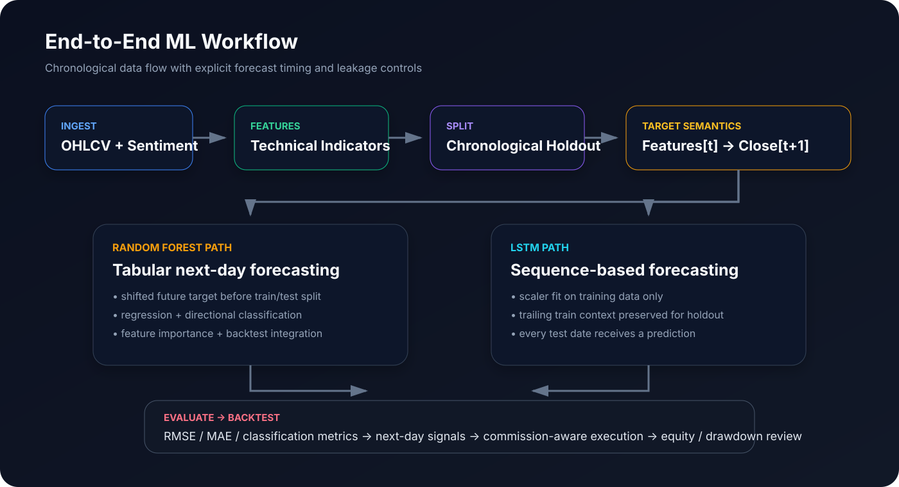

# Stock Price Predictor — LSTM, Random Forest & Backtesting

## For an AI data analyst application

**Frame this as forecasting hygiene, not a trading product.** The thing to defend is leakage control: next-day targets, train-only scaling, no future news. The charts below are the analysis surface. A careless same-day target would make the fit look brilliant and be wrong.

<p align="center"></p>
<p align="center"> </p>
<p align="center"></p>

<p align="center">
  
</p>

<p align="center">
  <a href="https://github.com/ParBproject/stock-price-predictor/actions/workflows/ci.yml"></a>
  
  
  
  
</p>

A time-series machine-learning project for next-day stock-price forecasting that compares **LSTM** and **Random Forest** models, then evaluates whether those predictions remain meaningful in a historical trading workflow.

The repository is designed around a simple principle: **evaluation code is part of the model**. Target timing, scaling, sentiment alignment, holdout construction, trading signals, fees, and equity-curve bookkeeping are all treated as correctness-sensitive logic and covered by regression tests.

## What This Project Demonstrates

- Historical OHLCV ingestion with `yfinance`
- Technical-indicator and lag feature engineering
- Optional VADER news-sentiment features
- LSTM sequence modelling with TensorFlow/Keras
- Random Forest regression and directional classification
- Chronological train/test separation
- Train-only feature scaling
- Explicit next-day target alignment
- Leakage-aware LSTM holdout sequencing
- Backtrader strategy validation
- Commission-aware position sizing
- Regression tests and GitHub Actions CI

## End-to-End Workflow

<p align="center">
  
</p>

The two model paths use different representations but the same time-series discipline:

| Stage | Random Forest | LSTM |
|---|---|---|
| Input | Engineered tabular features | Rolling multivariate sequences |
| Forecast target | `Close[t+1]` from features at `t` | Next observed close from prior sequence context |
| Split | Chronological | Chronological |
| Scaling | Not required by model | `MinMaxScaler` fit on training data only |
| Holdout handling | Shift target before 80/20 split | Test windows prepend trailing training history |
| Evaluation | Regression + direction classification | Regression + strategy-oriented review |
| Strategy validation | Backtrader next-day signals | Finance metrics from known-prior-close comparisons |

## Correctness Safeguards

<p align="center">
  
</p>

Several subtle time-series and backtesting bugs were explicitly removed from the project:

- **Same-day target leakage:** Random Forest features at date `t` now predict `Close[t+1]`, instead of training against the same day's close-derived target. The holdout table that follows puts persistence beside the LSTM and the Random Forest, and labels the same-day fit as leaky.
- **Future-news leakage:** sentiment alignment only forward-fills information already observed; dates before the first headline remain neutral.
- **Fabricated sentiment:** missing news data returns neutral `0.0` sentiment instead of a synthetic random walk.
- **Dropped LSTM holdout predictions:** the first test sequence now uses the final training-history window, so the initial test period is not discarded.
- **Stale backtest signals:** next-day forecasts are compared against the current known close, not the previous day's close.
- **Commission oversizing:** all-in share sizing reserves cash for trading fees and uses available cash rather than total portfolio value.
- **Equity-curve mismatch:** the backtest records exactly one portfolio value per bar and validates value/date alignment before plotting.

These cases are covered by unit tests under `tests/` and run automatically in GitHub Actions.

### Next-day holdout and the same-day leak

`scripts/compare_holdout_baselines.py` scores one chronological holdout. The requested window is AAPL from 2015-01-01 through 2024-12-31 (`yfinance` `end` is exclusive). After indicator warm-up the feature frame in `data/AAPL_features.csv` runs from 2015-03-16 through 2024-12-30 (2,466 rows). No news API key was set, so `Sentiment` is the neutral `0.0` fallback.

Features at date `t` predict `Close[t+1]`, then `split = int(len(samples) * 0.80)`. That is the boundary in `notebooks/random_forest_model.ipynb` and `notebooks/backtesting.ipynb`. The scored targets are 2023-01-13 through 2024-12-30 (493 sessions). The LSTM notebook's test window also includes 2023-01-12; that extra session is left out so all three forecasts use the same closes.

MAE is adjusted dollars from `regression_metrics`. Directional hit rate is the fraction of sessions where the forecast is on the same side of the previous close as the realized close. Up means strictly above that close, the same rule as `next_day_direction_signals`. Persistence sets tomorrow's close equal to today's close, so its hit rate is the share of holdout sessions that were not up. The LSTM number is only meaningful next to that persistence number.

| Model | Sample | MAE | Directional hit rate | Leaky |
| --- | --- | ---: | ---: | --- |
| Persistence | holdout | 1.879523 | 0.4381 | no |
| LSTM | holdout | 26.904755 | 0.4584 | no |
| Random Forest | holdout | 20.702787 | 0.4523 | no |
| Random Forest same-day (leaky) | holdout | 18.326268 | 0.5700 | yes |
| Random Forest same-day (leaky) | in-sample fit | 0.181557 | 0.9437 | yes |

The last two rows are **leaky**. They fit the same Random Forest family on `Close[t]` using features at `t`, which already determine that close. On the training dates (2015-03-16 through 2023-01-11) the fit looks tight: MAE 0.18 and a 0.94 hit rate. That is how good it looks when it cheats. It is not a forecast. On the holdout the same cheat still loses to persistence, because the forest predicts averages from training leaves and the holdout price level moves beyond the training range. Full write-up: `results/holdout_baseline.md`.

## Model & Analysis Visuals

The repository also contains generated analysis outputs from the modelling notebooks.

<table>
  <tr>
    <td width="50%" align="center"><strong>Exploratory Analysis</strong><br/></td>
    <td width="50%" align="center"><strong>LSTM Predictions</strong><br/></td>
  </tr>
  <tr>
    <td width="50%" align="center"><strong>Random Forest Feature Importance</strong><br/></td>
    <td width="50%" align="center"><strong>Backtest Equity Curve</strong><br/></td>
  </tr>
</table>

Additional outputs include:

- `results/lstm_loss_curves.png`
- `results/rf_confusion_matrix.png`
- `results/holdout_baseline.md` and `results/holdout_baseline.csv`

> The notebook outputs are research snapshots. Re-run the notebooks after code changes to regenerate metrics and plots from the latest pipeline.

## Repository Structure

```text
stock-price-predictor/
├── .github/
│   └── workflows/
│       └── ci.yml
├── data/
│   ├── fetch_data.py
│   └── AAPL_features.csv
├── scripts/
│   └── compare_holdout_baselines.py
├── docs/
│   └── visuals/
│       ├── project_overview.svg
│       ├── ml_pipeline.svg
│       └── correctness_safeguards.svg
├── notebooks/
│   ├── eda.ipynb
│   ├── lstm_model.ipynb
│   ├── random_forest_model.ipynb
│   └── backtesting.ipynb
├── results/
│   ├── eda_dashboard.png
│   ├── holdout_baseline.csv
│   ├── holdout_baseline.md
│   ├── lstm_predictions.png
│   ├── lstm_loss_curves.png
│   ├── rf_feature_importance.png
│   ├── rf_confusion_matrix.png
│   └── equity_curve.png
├── src/
│   ├── backtesting.py
│   ├── baseline.py
│   ├── data_loader.py
│   ├── evaluator.py
│   ├── model_trainer.py
│   └── sentiment_analyzer.py
├── tests/
│   ├── test_backtesting.py
│   ├── test_baseline.py
│   ├── test_data_loader.py
│   └── test_sentiment_analyzer.py
├── requirements.txt
└── README.md
```

## Reproduce the Project

```bash
git clone https://github.com/ParBproject/stock-price-predictor.git
cd stock-price-predictor

python -m venv .venv
source .venv/bin/activate
pip install -r requirements.txt

python -m pytest -q
python scripts/compare_holdout_baselines.py
jupyter notebook
```

Recommended notebook order:

1. `notebooks/eda.ipynb`
2. `notebooks/lstm_model.ipynb`
3. `notebooks/random_forest_model.ipynb`
4. `notebooks/backtesting.ipynb`

## Testing & CI

The GitHub Actions workflow performs:

```text
Ruff critical-error checks
        ↓
Python source compilation
        ↓
Pytest regression suite
```

The tests focus on behavior that can silently invalidate time-series results, including future-target alignment, invalid horizons, LSTM holdout windows, sentiment timing, signal semantics, fee-aware sizing, and portfolio/date alignment.

## Skills Demonstrated

**Machine learning:** TensorFlow, Keras, scikit-learn, Random Forest, LSTM  
**Data:** pandas, NumPy, yfinance, technical indicators, time-series feature engineering  
**Evaluation:** leakage prevention, chronological validation, regression/classification metrics, backtesting  
**Engineering:** modular Python, regression testing, CI/CD, defensive validation, Git/GitHub workflows  
**Finance:** next-day signals, commissions, Sharpe ratio, drawdown, equity-curve analysis

## Responsible Use

This repository is an educational and research project, **not financial advice**. Market prediction is inherently uncertain, and historical or simulated performance does not guarantee future results.

A production trading system would require additional work such as walk-forward validation, realistic slippage modelling, market-impact assumptions, model/data monitoring, risk limits, and independent validation.
