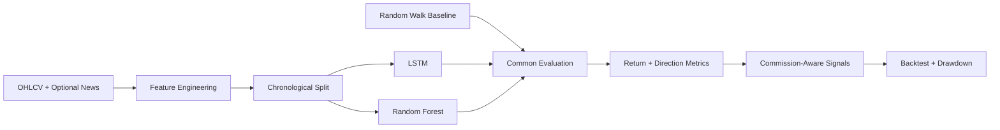

# Equity Forecasting Research Lab — LSTM, Random Forest & Backtesting

<p align="center">
  
</p>

<p align="center">
  <a href="https://github.com/ParBproject/stock-price-predictor/actions/workflows/ci.yml"></a>
  
  
  
  
</p>

A quantitative forecasting project that evaluates whether **LSTM and Random Forest models contain useful out-of-sample information beyond simple market baselines**.

The repository focuses on an idea that matters in real forecasting work:

> **Evaluation code is part of the model.**

Target timing, train/test chronology, scaling, sentiment timestamps, forecast baselines, trading signals, transaction costs, and backtest bookkeeping are all treated as correctness-sensitive research components.

## Employer snapshot

| Capability | Evidence |
|---|---|
| Real financial data | Historical OHLCV via `yfinance` |
| Machine learning | LSTM, Random Forest regression, directional classification |
| Time-series discipline | Chronological splits, train-only scaling, horizon-aware CV gaps |
| Baseline testing | Random walk and trailing-mean-return forecasts |
| Return-space analysis | Return MAE/RMSE, directional accuracy, return correlation |
| Walk-forward research | Explicit expanding/rolling chronological validation windows |
| Economic evaluation | Long/flat strategy returns, commissions, Sharpe, drawdown |
| Sentiment | Timestamp-aware VADER features with neutral missing-data handling |
| Backtesting | Backtrader validation and fee-aware sizing |
| Engineering | Regression tests, defensive validation, CI on Python 3.10/3.12 |
| Governance | Dedicated model/research card with scope and limitations |

## Research question

The project is not framed as “can a neural network fit stock prices?”

It asks a stricter sequence of questions:

1. Can the model beat a **random-walk forecast** on the same holdout sample?
2. Does it improve errors in **return space**, not only absolute price levels?
3. Does it correctly predict **direction**?
4. Does forecast information survive **chronological validation**?
5. Does it retain economic value after **transaction costs**?
6. Are the results robust enough to matter relative to simple alternatives?

## End-to-end workflow

### Research architecture


```mermaid
flowchart LR
    A[OHLCV + Optional News] --> B[Feature Engineering]
    B --> C[Chronological Split]
    C --> D[LSTM]
    C --> E[Random Forest]
    F[Random Walk Baseline] --> G[Common Evaluation]
    D --> G
    E --> G
    G --> H[Return + Direction Metrics]
    H --> I[Commission-Aware Signals]
    I --> J[Backtest + Drawdown]
```


<p align="center">
  
</p>

```text
Historical OHLCV
        ↓
Feature engineering
        ↓
Explicit future target alignment
        ↓
Chronological train / validation / holdout
        ↓
Train-only preprocessing
        ↓
LSTM / Random Forest
        ↓
Price-space evaluation
        ↓
Return-space + direction evaluation
        ↓
Naïve baseline comparison
        ↓
Signal construction
        ↓
Commission-aware backtesting
        ↓
Risk-adjusted interpretation
```

## Forecasting paths

| Stage | Random Forest | LSTM |
|---|---|---|
| Input | Engineered tabular features | Rolling multivariate sequences |
| Forecast target | `Close[t+1]` from features at `t` | Next observed close from prior sequence context |
| Split | Chronological | Chronological |
| Scaling | Not required by model | `MinMaxScaler` fit on training data only |
| Holdout handling | Shift target before split | Test windows prepend trailing training history |
| Validation | Horizon-aware chronological folds | Chronological validation |
| Evaluation | Regression + direction + baseline comparison | Regression + strategy-oriented review |
| Economic layer | Commission-aware signals | Finance metrics from known-prior-close comparisons |

## Baselines matter

A model can look impressive while adding little value over a trivial forecast.

The new research-evaluation layer in `src/research_evaluation.py` includes:

**Random walk**

```text
Predicted Close[t+1] = Close[t]
```

**Trailing mean return**

```text
Predicted Close[t+1]
= Close[t] × (1 + mean of trailing realized returns)
```

The trailing benchmark uses only returns already observed by the forecast date.

The helper `compare_with_random_walk()` evaluates the model and baseline on the exact same observations.

## Return-space evaluation

Absolute price prediction can be misleading because equity price levels are highly persistent.

The project therefore also converts forecasts into:

```text
Predicted Return[t+1] = Predicted Close[t+1] / Close[t] - 1
Actual Return[t+1]    = Actual Close[t+1] / Close[t] - 1
```

The research layer reports:

- price MAE;
- price RMSE;
- return MAE;
- return RMSE;
- directional accuracy;
- predicted-vs-realized return correlation.

This makes it harder for a model to look successful simply by predicting a value close to today's price.

## Walk-forward validation

`walk_forward_windows()` produces explicit chronological research windows.

For every window:

```text
training observations < test observations
```

The utility supports both:

- **expanding windows** — the training history grows over time;
- **rolling windows** — the training history keeps a fixed length.

No test observation is included in the preceding training slice.

## Correctness safeguards

<p align="center">
  
</p>

The project includes regression coverage for subtle failure modes that can invalidate time-series work:

- **Same-day target leakage** — features at `t` predict `t+1`, not a target derived from the same row.
- **Future-news leakage** — sentiment is only aligned after the information becomes observable.
- **Fabricated sentiment** — unavailable news produces neutral sentiment rather than synthetic values.
- **Train/test scaling leakage** — LSTM scaling is fit only on the training data.
- **Dropped holdout predictions** — the first LSTM holdout prediction receives trailing training context.
- **Cross-validation overlap** — forecast-horizon gaps separate training labels from validation feature periods.
- **Stale signal semantics** — next-close forecasts are compared with the currently known close.
- **Commission oversizing** — position sizing reserves cash for transaction fees.
- **Equity/date mismatch** — backtest values and timestamps must reconcile one-to-one.
- **Baseline sample mismatch** — model and benchmark evaluation use identical forecast observations.

## Economic evaluation

Forecasts can be converted to long/flat signals:

```text
Long if Predicted Close[t+1] > Current Close[t]
Flat otherwise
```

Strategy evaluation includes:

- transaction-cost deductions on position changes;
- cumulative strategy return;
- annualized Sharpe ratio;
- maximum drawdown;
- Backtrader validation;
- buy-and-hold comparison;
- fee-aware whole-share sizing.

Economic performance is reported separately from statistical forecast accuracy.

## Model & analysis visuals

<table>
  <tr>
    <td width="50%" align="center"><strong>Exploratory Analysis</strong><br/></td>
    <td width="50%" align="center"><strong>LSTM Predictions</strong><br/></td>
  </tr>
  <tr>
    <td width="50%" align="center"><strong>Random Forest Feature Importance</strong><br/></td>
    <td width="50%" align="center"><strong>Backtest Equity Curve</strong><br/></td>
  </tr>
</table>

Additional outputs include:

- `results/lstm_loss_curves.png`
- `results/rf_confusion_matrix.png`

Notebook outputs are research snapshots and should be regenerated after modeling changes.

## Repository structure

```text
stock-price-predictor/
├── data/
│   └── fetch_data.py
├── docs/
│   └── visuals/
│       ├── project_overview.svg
│       ├── ml_pipeline.svg
│       └── correctness_safeguards.svg
├── notebooks/
│   ├── eda.ipynb
│   ├── lstm_model.ipynb
│   ├── random_forest_model.ipynb
│   └── backtesting.ipynb
├── results/
├── src/
│   ├── backtesting.py
│   ├── data_loader.py
│   ├── evaluator.py
│   ├── model_trainer.py
│   ├── research_evaluation.py
│   └── sentiment_analyzer.py
├── tests/
├── MODEL_CARD.md
├── requirements.txt
└── README.md
```

## Reproduce the project

```bash
git clone https://github.com/ParBproject/stock-price-predictor.git
cd stock-price-predictor

python -m venv .venv
source .venv/bin/activate
python -m pip install -r requirements.txt

python -m pytest -q
jupyter notebook
```

Recommended notebook order:

1. `notebooks/eda.ipynb`
2. `notebooks/lstm_model.ipynb`
3. `notebooks/random_forest_model.ipynb`
4. `notebooks/backtesting.ipynb`

## Testing and CI

GitHub Actions now runs the research regression suite on Python **3.10 and 3.12**:

```text
Critical-error linting
        ↓
Source compilation
        ↓
Regression tests
        ↓
Research-module import checks
```

Tests cover target alignment, scaling behavior, sequence construction, sentiment timing, signal semantics, commission handling, backtest bookkeeping, baseline evaluation, and walk-forward window chronology.

## Model governance

See **[MODEL_CARD.md](MODEL_CARD.md)** for:

- intended use;
- forecasting targets;
- data scope;
- leakage controls;
- statistical evaluation;
- economic evaluation;
- known limitations;
- production requirements not implemented.

## Skills demonstrated

**Machine learning:** TensorFlow, Keras, Random Forest regression/classification, time-series CV.

**Data analysis:** pandas, NumPy, yfinance, technical indicators, feature engineering, stationarity analysis.

**Quantitative evaluation:** naïve baselines, return-space error, directional accuracy, Sharpe, drawdown, commission-aware strategy analysis.

**Engineering:** modular Python, regression testing, CI/CD, defensive validation, reproducible model artifacts.

**Research discipline:** chronological validation, leakage prevention, model governance, explicit limitations.

## Limitations

- Historical market relationships can change across regimes.
- Accurate price-level predictions do not necessarily imply useful return forecasts.
- Transaction-cost assumptions are simplified.
- Slippage, market impact, borrow costs, taxes, and execution latency are not fully modeled.
- Repeated tuning against the same holdout period can overfit the evaluation process.
- Sentiment quality depends on source coverage and timestamp integrity.

## Responsible use

This is an educational and research portfolio project, not financial advice. Historical or simulated performance does not guarantee future results.
