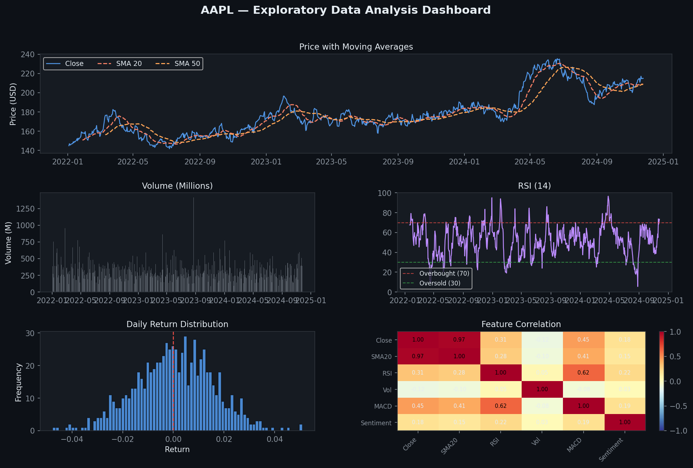
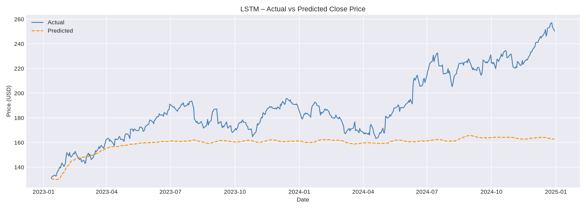
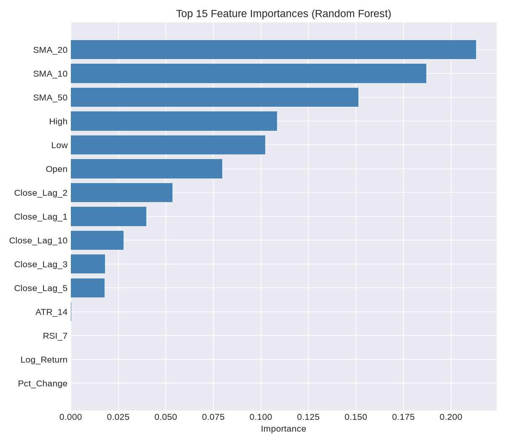
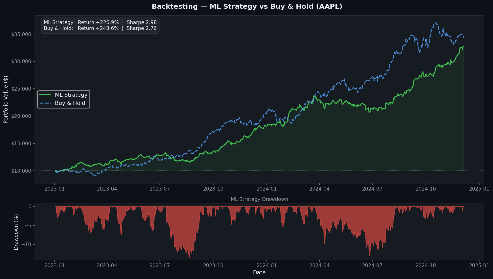

# Stock Price Predictor — LSTM & Random Forest

A machine-learning research project that compares LSTM and Random Forest approaches for next-day AAPL price modelling, then evaluates predictions in a historical backtesting workflow.

## Project Highlights

- Market-data ingestion with yfinance
- Exploratory analysis and stationarity testing
- Technical indicators and optional news-sentiment features
- Sequence modelling with TensorFlow/Keras LSTM
- Tree-based modelling with scikit-learn Random Forest
- Regression and directional-classification evaluation
- Historical strategy backtesting and equity-curve analysis

## Results Showcase

### Exploratory Analysis

### LSTM Predictions

### Random Forest Feature Importance

### Backtest Equity Curve

## Methodology

| Stage | Approach |
|---|---|
| Data | Historical AAPL market data from yfinance |
| Features | Returns, moving averages, volatility, volume, and optional sentiment |
| Models | LSTM sequence model and Random Forest |
| Validation | Time-aware train/test separation |
| Evaluation | RMSE, MAE, directional accuracy, classification metrics |
| Strategy review | Backtest compared with a passive benchmark |

## Repository Structure

~~~text
stock-price-predictor/
├── data/
│   └── fetch_data.py
├── notebooks/
│   ├── eda.ipynb
│   ├── lstm_model.ipynb
│   ├── random_forest_model.ipynb
│   └── backtesting.ipynb
├── src/
│   ├── data_loader.py
│   ├── model_trainer.py
│   ├── evaluator.py
│   └── sentiment_analyzer.py
├── results/
└── requirements.txt
~~~

## Reproduce the Project

~~~bash
git clone https://github.com/ParBproject/stock-price-predictor.git
cd stock-price-predictor

python -m venv .venv
source .venv/bin/activate
pip install -r requirements.txt

jupyter notebook
~~~

Run the notebooks in this order: EDA, LSTM model, Random Forest model, then backtesting.

## Skills Demonstrated

Python, pandas, time-series analysis, feature engineering, TensorFlow, scikit-learn, evaluation design, data visualization, modular code organization, and communicating model limitations.

## Responsible Use

This project is educational research, not financial advice. Market prediction is inherently uncertain, and historical or simulated performance does not guarantee future results. Production use would require walk-forward validation, transaction-cost modelling, monitoring, and independent risk review.
