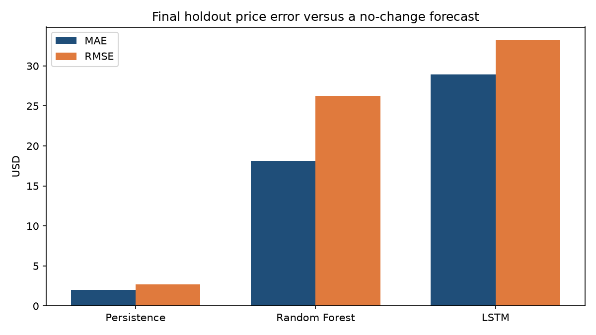
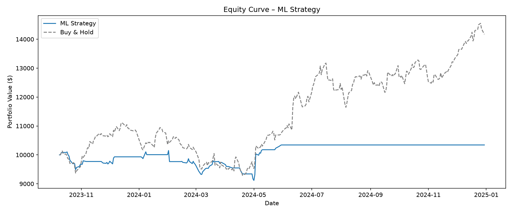
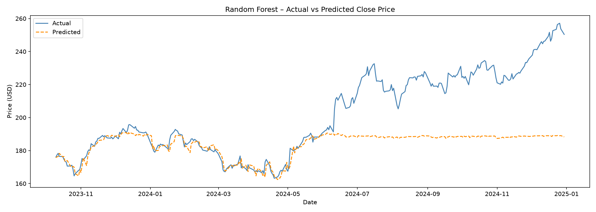
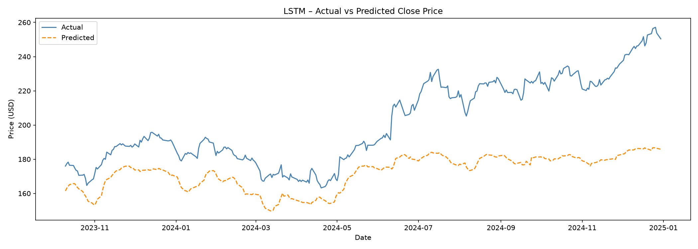
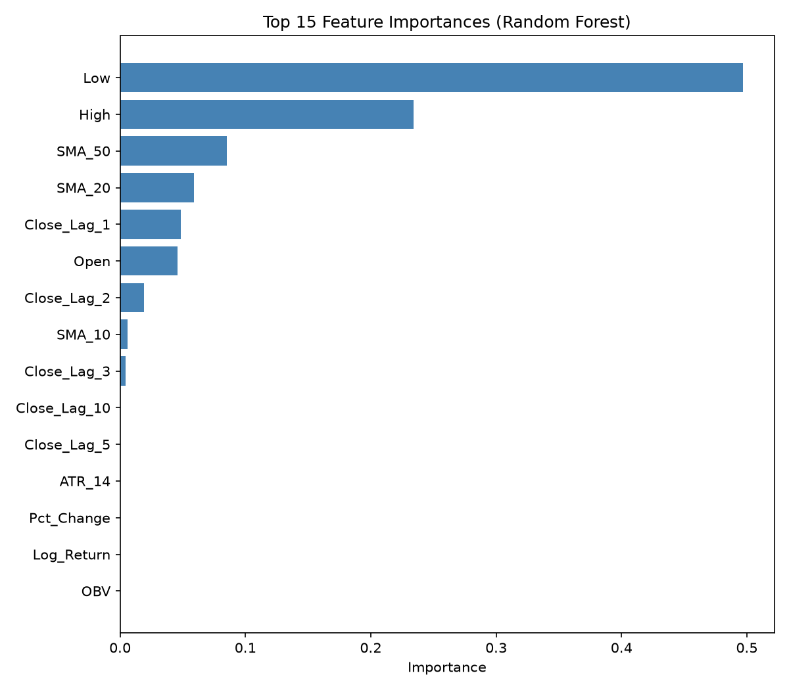
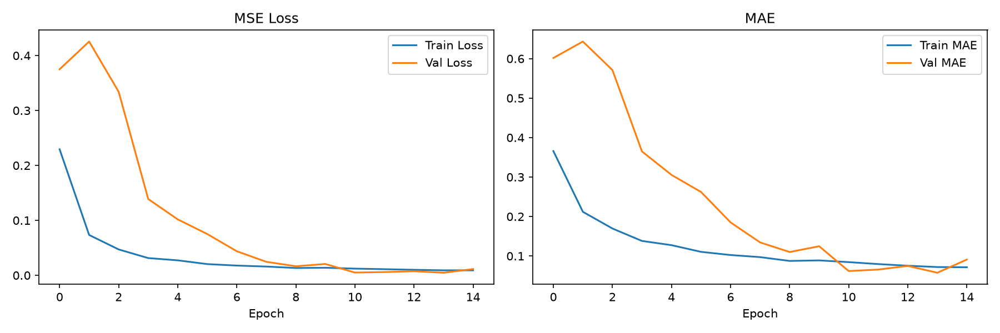
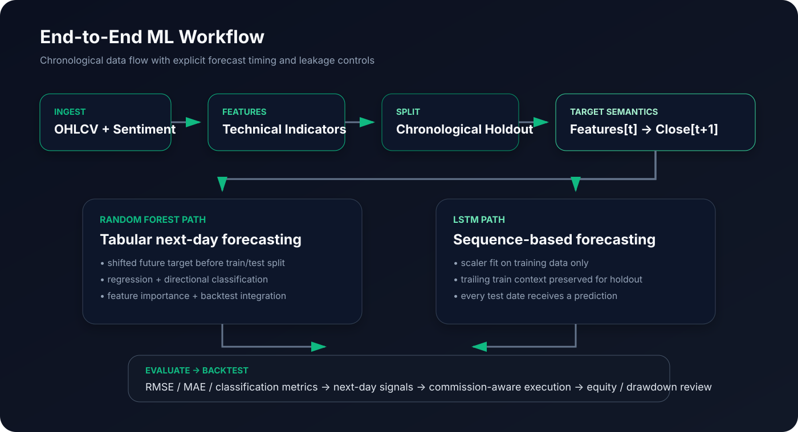
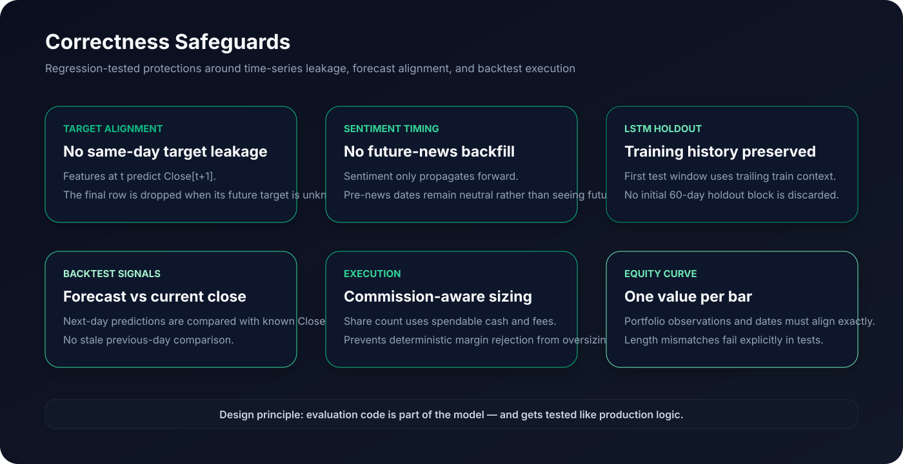

# Stock Price Predictor

A leakage-aware study of **next-day Apple close forecasts**. A walk-forward random forest and a holdout LSTM are scored against a no-change baseline, then a long/flat rule is compared with buy and hold after commission.

**Not financial advice.** This is research code. Nothing here is a recommendation to buy or sell any security. Simulated history is not future performance.

<p>
  <a href="https://github.com/ParBproject/stock-price-predictor/actions/workflows/ci.yml"></a>
  
  
  
</p>

## Live demo

Employer-facing walk-forward results, served as a static page:

**[parbproject.github.io/stock-price-predictor](https://parbproject.github.io/stock-price-predictor/)**

The page scores a Random Forest next-day close forecast against a persistence baseline (tomorrow's close equals today's). It does not claim the model beats that baseline. The LSTM is not included.

## The result that matters

On adjusted AAPL prices from 2015-01-01 through 2024-12-31, **predicting tomorrow's close with today's close beats both models on price error**. The trading rule also finishes behind buy and hold. Figures below are rounded from [`results/metrics.json`](results/metrics.json), produced by:

```bash
python -m src.pipeline --ticker AAPL --start 2015-01-01 --end 2024-12-31 --refresh --lstm --epochs 15
```

Walk-forward means across four expanding folds (308 test days each, one-row embargo):

| | MAE (USD) | RMSE (USD) | Directional accuracy |
|---|---:|---:|---:|
| Persistence (tomorrow = today) | 1.98 | 2.67 | — |
| Random forest | 16.84 | 22.00 | 45.8% |

Skill score `1 - MAE_model / MAE_persistence` averages **-7.58**. It is negative in every fold.

| Fold | Test window | RF MAE | Persistence MAE | Skill |
|---|---|---:|---:|---:|
| 1 | 2020-02-07 – 2021-04-28 | 28.69 | 1.89 | -14.17 |
| 2 | 2021-04-29 – 2022-07-19 | 15.93 | 2.06 | -6.75 |
| 3 | 2022-07-20 – 2023-10-09 | 4.63 | 2.00 | -1.31 |
| 4 | 2023-10-10 – 2024-12-30 | 18.12 | 1.99 | -8.10 |

Final holdout only (fold 4, 308 days). The LSTM is trained on history before this window for 15 epochs; early stopping restored the weights from epoch 14.

| | MAE | RMSE | MAPE | Up/down accuracy |
|---|---:|---:|---:|---:|
| Persistence | $1.99 | $2.72 | 0.99% | — |
| Random forest | $18.12 | $26.29 | 8.06% | 43.2% |
| LSTM | $28.95 | $33.20 | 13.68% | 44.2% |

A separate direction classifier on the same holdout is **42.9% accurate**. The training-set majority class is "up" and scores **55.8%** by always predicting up. Precision on up days is 47.4%, recall is 20.9%, F1 is 0.29.

Backtest of the random-forest long/flat rule on that holdout, starting from $10,000 with 0.1% commission and next-open fills:

| | Final value | Total return | Sharpe | Max drawdown |
|---|---:|---:|---:|---:|
| Model strategy | $10,371.05 | 3.71% | -0.037 | -11.60% |
| Buy and hold | $14,171.10 | 41.71% | 1.265 | -16.38% |

<p align="center"></p>
<p align="center"></p>

Price-level error looks small for the no-change forecast because a close is highly persistent. The same plots make the model failure obvious: the forest and the LSTM do not follow the 2024 rally, and the equity curve stays near cash while buy and hold compounds.

<p align="center"> </p>

Lagged prices, moving averages, and on-balance volume dominate the forest. Those features sit inside the training price range, and a tree ensemble cannot extrapolate a market that keeps making new highs. The LSTM loss falls in scaled units (best epoch 14) while the dollar error on the holdout remains far above the persistence line. Scaled loss and tradable skill are different questions.

<p align="center"> </p>

Vendor-adjusted prices can be revised later, so a fresh download can nudge these figures. The JSON file is the record of this run. `python -m src.pipeline --demo` is an offline smoke test on a seeded random walk. Those numbers are not market results.

## What it does

- Downloads split- and dividend-adjusted OHLCV with `yfinance` (`auto_adjust=True`)
- Builds technical indicators, lags, and an optional VADER sentiment column
- Stores the feature frame in SQLite and reloads a date range with parameterized SQL
- Drops constant columns. With no `NEWS_API_KEY`, sentiment is 0.0 and is removed rather than treated as a signal
- Aligns each feature row at date *t* with `Close[t+1]`
- Evaluates a random forest on expanding walk-forward folds with a one-day embargo, so a training label cannot fall inside the next test window
- Fits the LSTM scaler on pre-holdout rows only, and builds each test sequence from already observed history
- Compares both models with a persistence baseline and the direction model with a majority-class baseline
- Turns the random-forest direction into long/flat returns with next-open fills and commission, and compares that curve with a buy-and-hold book that pays the same entry fee

## Stack

Python 3.12+, pandas, NumPy, scikit-learn, TensorFlow/Keras, SQLite, Backtrader, yfinance, statsmodels, matplotlib, pytest, Ruff, GitHub Actions.

## Pipeline

<p align="center"></p>

| Stage | Random forest | LSTM |
|---|---|---|
| Input | Tabular indicators and lags at *t* | 60-day windows ending at *t* |
| Target | `Close[t+1]` | Next close after the window |
| Split | 4 expanding folds, gap of 1 row | Final fold only, validation carved from earlier history |
| Scaling | None | `MinMaxScaler` fit on the training block only |
| Published run | 200 trees, depth 20, `n_jobs=1`, no grid search | 15 epochs, early stopping, batch 32 |

<p align="center"></p>

The safeguards covered by tests:

- Features at *t* predict `Close[t+1]`, not the same day's close
- News after the NYSE close, including early-close sessions, is dated to the next session. Missing headlines stay at neutral 0.0
- LSTM holdout windows prepend the trailing training history instead of dropping the first test dates
- Random-forest tuning, when enabled with `--tune`, uses `TimeSeriesSplit` with a gap equal to the forecast horizon
- Saved scikit-learn models must carry the same feature names in the same order before a notebook backtest will load them
- Position size reserves cash for commission. The equity curve stores one portfolio value per bar

## Run it

```bash
git clone https://github.com/ParBproject/stock-price-predictor.git
cd stock-price-predictor

python -m venv .venv
source .venv/bin/activate
pip install -r requirements.txt -r requirements-lstm.txt -r requirements-dev.txt

python -m pytest -q
python -m src.pipeline --ticker AAPL --start 2015-01-01 --end 2024-12-31 --refresh --lstm --epochs 15
```

The forecast command needs a network connection for Yahoo Finance data. It reprints the metrics and writes:

- `results/metrics.json`
- `results/baseline_comparison.png`, `results/equity_curve.png`
- `results/rf_predictions.png`, `results/rf_feature_importance.png`, `results/rf_confusion_matrix.png`
- `results/lstm_predictions.png`, `results/lstm_loss_curves.png`
- `results/eda_dashboard.png`
- `data/market.sqlite` (local cache, not committed)

`--demo` skips the download and runs the same code on synthetic prices. `--tune` grid-searches the forest inside every fold and is much slower. Omit `--lstm` to skip TensorFlow.

Notebooks are the interactive version of the same ideas. Install them with `pip install -r requirements-notebooks.txt`, then open `notebooks/eda.ipynb`, `notebooks/random_forest_model.ipynb`, `notebooks/lstm_model.ipynb`, and `notebooks/backtesting.ipynb`.


### Regenerate the live-demo data

From the repository root, with the project dependencies installed:

```bash
python scripts/build_demo.py
```

The script downloads adjusted daily bars for AAPL, MSFT, and SPY, runs the leakage-safe Random Forest walk-forward evaluation, and rewrites `site/data/demo.json`. It does not train the LSTM. Commit the JSON. The Pages workflow publishes the `site/` folder and does not re-run the model.

Optional news sentiment: copy `.env.example` to `.env` and set `NEWS_API_KEY`. The free NewsAPI tier does not backfill 2015–2024, so the published run does not use headlines.

## Layout

```text
stock-price-predictor/
├── .github/workflows/
│   ├── ci.yml
│   └── pages.yml
├── scripts/build_demo.py
├── site/
├── data/fetch_data.py
├── docs/visuals/
├── notebooks/
├── results/                  # charts and metrics.json from the command above
├── src/
│   ├── pipeline.py           # python -m src.pipeline
│   ├── baselines.py
│   ├── feature_store.py      # SQLite cache and SQL reloads
│   ├── data_loader.py
│   ├── validation.py
│   ├── scaling.py
│   ├── model_trainer.py
│   ├── model_artifacts.py
│   ├── sentiment_analyzer.py
│   ├── backtesting.py
│   └── evaluator.py
├── tests/
├── requirements.txt
├── requirements-lstm.txt
├── requirements-notebooks.txt
└── requirements-dev.txt
```

## Tests and CI

GitHub Actions installs the pinned runtime and dev requirements on Python 3.12, runs Ruff on critical syntax errors, compiles the sources, and runs pytest. The suite covers target alignment, the walk-forward embargo, neutral sentiment, fee-aware sizing, equity/date alignment, the SQLite round trip, and an offline demo of the pipeline. It does not download a new market history or retrain the published models on every push.

## Limitations and next steps

- One ticker and one decade. A rising price level punishes models that cannot extrapolate; that is visible here and would need a return or residual target to retest.
- The LSTM is scored on the final fold only. The forest is the walk-forward result.
- The published forest is not grid-searched. `--tune` is available and was not used for these numbers.
- Commission is a flat 0.1% of notional. There is no spread, slippage, or market-impact model.
- Sentiment is absent unless an API key can actually cover the sample. The constant column is dropped.
- In `notebooks/backtesting.ipynb`, `MLSignalStrategy.next()` returns while an order is pending without advancing the signal index, so a later bar can be paired with an earlier signal. That is a known bug ([#65](https://github.com/ParBproject/stock-price-predictor/issues/65)). The equity curve reported above does not use that method. It comes from `next_open_long_flat_returns`, which applies one signal to each target bar.
- A production trading system would still need walk-forward across names, risk limits, and monitoring. This repository stops at a reproducible historical study.

## Responsible use

Educational and research use only. **Not financial advice.** Historical or simulated performance does not predict future results.
